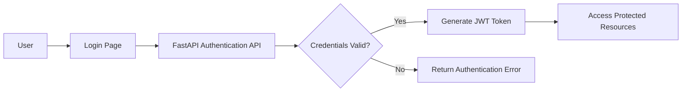

# Security Architecture

## Overview

NexusERP will follow secure software development practices to protect users, business data, supplier information, and purchase order information.

---

## Authentication

Users must log in using their registered email address and password.

The backend will issue a JSON Web Token after successful authentication.



---

## Password Security

Passwords will:

- Never be stored as plain text
- Be hashed before storage
- Use a secure password-hashing algorithm
- Require a minimum password length
- Be excluded from API responses and logs

---

## Role-Based Access Control

NexusERP will use role-based access control.

### Procurement Officer

Can:

- Create suppliers
- Update suppliers
- Create purchase orders
- Update draft purchase orders
- Submit purchase orders
- View purchase orders

Cannot:

- Approve purchase orders
- Manage users
- Change system roles

### Procurement Manager

Can:

- View suppliers
- View submitted purchase orders
- Approve purchase orders
- Reject purchase orders
- Review procurement reports

Cannot:

- Approve their own purchase orders

### System Administrator

Can:

- Create users
- Update users
- Assign roles
- Deactivate users
- View audit logs
- Configure system settings

---

## Authorization Rules

- Every protected API must validate the user's token.
- Every protected API must verify the user's role.
- Users cannot access functions outside their assigned permissions.
- Procurement officers cannot approve purchase orders.
- Users cannot approve purchase orders they created.
- Inactive users cannot log in.
- Inactive suppliers cannot be used for new purchase orders.

---

## Input Validation

The backend will validate:

- Required fields
- Email formats
- Numeric values
- Dates
- Purchase order quantities
- Purchase order prices
- Supplier status
- Allowed status transitions

Invalid requests will be rejected before database processing.

---

## API Security

The application will include:

- HTTPS in production
- JWT authentication
- Request validation
- Restricted cross-origin access
- Secure HTTP headers
- Rate limiting in future releases
- API versioning
- Error handling without exposing internal details

---

## Database Security

- Database credentials will not be stored directly in source code.
- Credentials will be stored using environment variables.
- Application users will receive only required database permissions.
- Sensitive data will not be written to application logs.
- Database backups will be protected.
- Foreign keys and constraints will protect data integrity.

---

## Audit Logging

Important actions will be recorded.

Examples:

- User login
- Failed login
- Supplier creation
- Supplier update
- Purchase order creation
- Purchase order submission
- Purchase order approval
- Purchase order rejection
- User role changes

Audit records should contain:

- User ID
- Action
- Entity type
- Entity ID
- Date and time
- Previous value
- New value
- IP address where available

---

## Secrets Management

The following information must not be committed to GitHub:

- Database passwords
- JWT secret keys
- OpenAI API keys
- External service credentials

A `.env` file will be used locally and excluded using `.gitignore`.

An example file may be included:

```text
.env.example
```

---

## Future Security Enhancements

- Multi-factor authentication
- Password reset workflow
- Account lockout
- Refresh tokens
- Advanced rate limiting
- Security event monitoring
- Vulnerability scanning
- Dependency scanning
- Container security
- AI security testing
