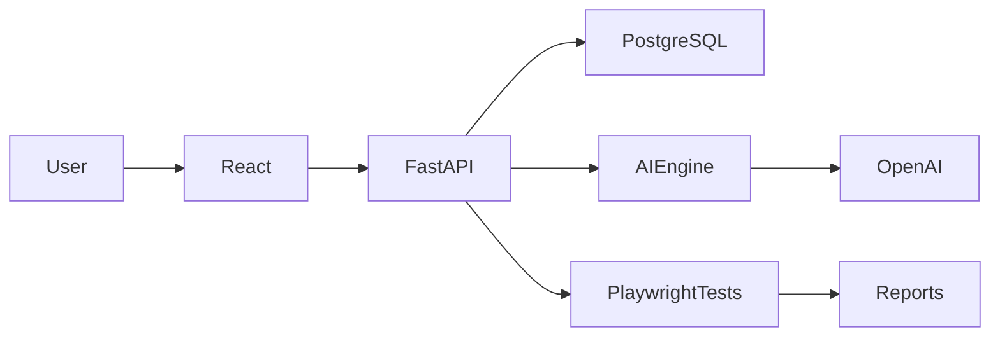

# System Architecture

## Overview

NexusERP is a modern web-based Enterprise Resource Planning (ERP) platform designed to demonstrate Enterprise Quality Engineering and AI-assisted software delivery.

The Procurement Management module is the first business module of the system.

---

# High-Level Architecture

---

# Components

## Frontend

Technology:

- React
- Material UI

Responsibilities:

- User Interface
- User Authentication
- Procurement Screens
- Dashboard
- Reports

---

## Backend

Technology:

- FastAPI

Responsibilities:

- Business Logic
- Authentication
- REST APIs
- Validation
- Workflow Management

---

## Database

Technology:

- PostgreSQL

Responsibilities:

- Supplier Data
- Purchase Orders
- Users
- Audit History

---

## AI Engine

Responsibilities:

- Requirement Analysis
- Test Case Generation
- Risk Analysis
- Defect Analysis
- AI Reporting

---

## Test Automation

Technology:

- Playwright
- TypeScript

Responsibilities:

- UI Testing
- API Testing
- Regression Testing
- Reporting
