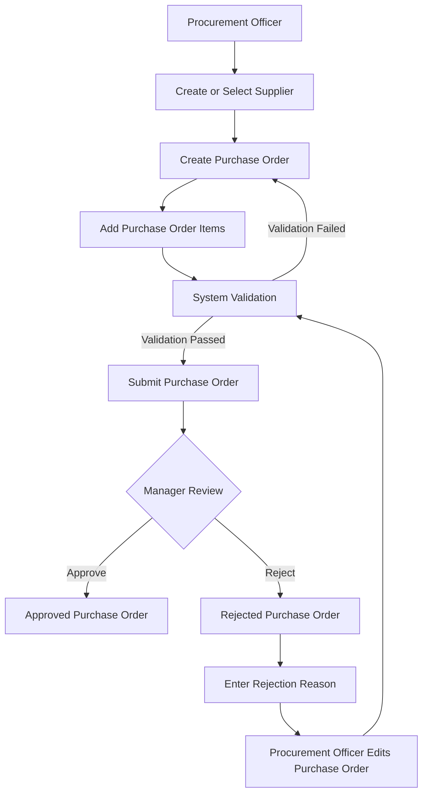

# Procurement Workflow

## Overview

The Procurement Management module follows a controlled approval process to ensure that purchase orders are validated, reviewed, and approved before purchasing activities continue.

## Workflow Diagram

## Workflow Steps

1. The Procurement Officer creates or selects an active supplier.
2. The Procurement Officer creates a purchase order.
3. One or more purchase order items are added.
4. The system validates the purchase order.
5. A valid purchase order is submitted for approval.
6. The Procurement Manager reviews the submitted purchase order.
7. The manager approves or rejects the purchase order.
8. A rejection reason is required when the purchase order is rejected.
9. The Procurement Officer may edit and resubmit a rejected purchase order.

## Purchase Order Statuses

| Status | Description |
|---|---|
| Draft | The purchase order is being prepared and may be edited. |
| Submitted | The purchase order is waiting for manager review. |
| Approved | The purchase order has been authorised. |
| Rejected | The purchase order has been rejected and requires correction. |
| Cancelled | The purchase order has been cancelled. |

## Future Workflow Extensions

Future versions will include:

- Purchase requisitions
- Approval limits
- Goods receipt
- Partial goods receipt
- Inventory updates
- Supplier invoice matching
- Financial posting
- AI risk analysis
- AI approval recommendations
