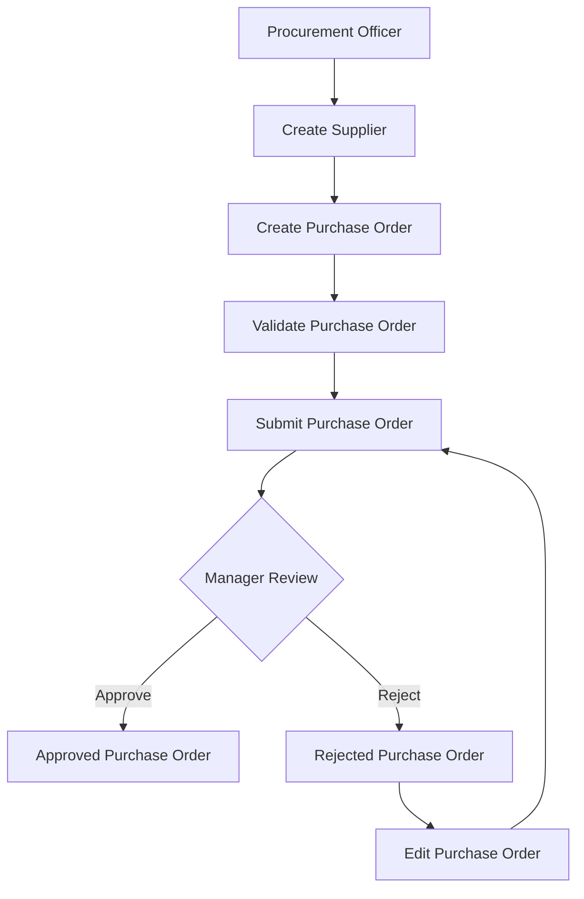

# Procurement Workflow

## Overview

The Procurement Management module follows a controlled approval process to ensure purchase orders are validated, reviewed, and approved before procurement activities continue.

---

## Procurement Workflow

---

## Workflow Description

1. Procurement Officer creates a supplier.
2. Procurement Officer creates a Purchase Order.
3. The system validates mandatory business rules.
4. The Purchase Order is submitted for approval.
5. The Procurement Manager reviews the request.
6. The Purchase Order is either approved or rejected.
7. If rejected, it is returned to the Procurement Officer for modification and resubmission.

---

## Future Enhancements

The workflow will later include:

- Goods Receipt
- Inventory Update
- Financial Posting
- Audit Logging
- AI Risk Analysis
- AI Approval Recommendation
