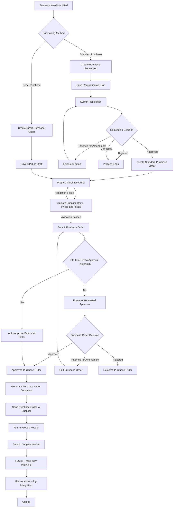

# Procurement Workflow

## 1. Overview

The NEXORA Procurement Management module follows a controlled workflow to ensure that purchasing activities are requested, reviewed, approved, issued to suppliers and fully traceable.

The workflow supports two purchasing paths:

1. Standard Purchase Process  
   A Purchase Requisition is created and approved before a Purchase Order is created.

2. Direct Purchase Order Process  
   An authorised Procurement Officer creates a Direct Purchase Order without a Purchase Requisition.

Both Standard Purchase Orders and Direct Purchase Orders follow the configured Purchase Order approval process.

---

## 2. Business Actors

| Role | Responsibility |
|---|---|
| Requesting Employee | Creates and submits Purchase Requisitions |
| Procurement Officer | Creates and manages Purchase Orders and Direct Purchase Orders |
| Nominated Approver | Reviews and decides on submitted procurement documents |
| Procurement Manager | Manages procurement controls and approval configuration |
| Supplier | Receives approved Purchase Orders and supplies requested goods or services |
| System Administrator | Maintains users, roles and system configuration |
| Warehouse Officer | Receives goods in a future phase |
| Quality Officer | Performs food-quality checks in a future phase |
| Accounts Payable Officer | Processes supplier invoices in a future phase |

---

## 3. High-Level Procurement Workflow



---

## 4. Standard Purchase Process

### Step 1 — Identify Business Need

A department identifies a requirement for goods or services.

Examples include:

- Raw materials
- Ingredients
- Packaging materials
- Cleaning and sanitation materials
- Maintenance items
- Non-stock items
- Services

---

### Step 2 — Create Purchase Requisition

The Requesting Employee creates a Purchase Requisition containing:

- Requested catalogue items
- Quantity
- Purchase Unit
- Required Date
- Estimated Price
- Department
- Business Justification

The initial status is:

```text
Draft
```

---

### Step 3 — Submit Purchase Requisition

The requester submits the completed requisition.

The system validates:

- At least one item is included
- Quantities are greater than zero
- Required information is complete
- Catalogue items are active

After submission, the requisition enters the approval workflow.

---

### Step 4 — Requisition Decision

The nominated approver may:

- Approve
- Reject
- Return for Amendment

If returned, a reason is mandatory and the requester may edit and resubmit the requisition.

If rejected, the process stops unless a new requisition is created.

If approved, Procurement may create a Standard Purchase Order.

---

### Step 5 — Create Standard Purchase Order

The Procurement Officer creates a Purchase Order from the approved requisition.

The Purchase Order must retain a reference to the source Purchase Requisition.

The system may transfer:

- Catalogue items
- Requested quantities
- Purchase units
- Required dates
- Supplier-item information

The initial Purchase Order status is:

```text
Draft
```

---

## 5. Direct Purchase Order Process

A Direct Purchase Order may be created without a Purchase Requisition.

This process is intended for authorised direct purchases.

The Procurement Officer must provide:

- Direct Purchase Reason
- Supplier
- Catalogue items or authorised non-catalogue description
- Quantities
- Prices
- Delivery information

A Direct Purchase Order follows the same approval threshold and approval workflow as a Standard Purchase Order.

A Direct Purchase Order does not automatically bypass approval controls.

---

## 6. Purchase Order Preparation

The Procurement Officer prepares the Purchase Order.

The Purchase Order includes:

- Purchase Order Number
- Order Type
- Supplier
- Supplier Contact
- Catalogue Items
- Supplier Item Codes
- Purchase Units
- Quantities
- Unit Prices
- Line Totals
- Purchase Order Total
- Delivery Address
- Required Delivery Date
- Terms and Notes

The system shall populate supplier-specific item details where available.

---

## 7. Purchase Order Validation

Before submission, the system validates that:

- The supplier is active
- All selected catalogue items are active
- At least one item is included
- Every quantity is greater than zero
- Every unit price is zero or greater
- Required fields are complete
- Minimum order quantities are satisfied where applicable
- Unit conversions are valid
- The Purchase Order total is correctly calculated

If validation fails, the Purchase Order remains editable.

---

## 8. Purchase Order Approval Threshold

The approval threshold shall be configurable.

The initial rule is:

```text
Purchase Order total below AUD 1,000
→ Automatically Approved

Purchase Order total of AUD 1,000 or more
→ Routed to the configured Nominated Approver
```

The threshold must not be permanently hardcoded into the application.

---

## 9. Manual Approval Decision

The Nominated Approver may:

- Approve
- Reject
- Return for Amendment

### Approve

The Purchase Order status becomes:

```text
Approved
```

The approver, date, time and comments are recorded.

### Reject

A rejection reason is mandatory.

The Purchase Order status becomes:

```text
Rejected
```

The rejected Purchase Order does not proceed to the supplier.

### Return for Amendment

A return reason is mandatory.

The Purchase Order status becomes:

```text
Returned for Amendment
```

The Procurement Officer may edit and resubmit it.

---

## 10. Send Purchase Order to Supplier

Only Approved Purchase Orders may be sent to suppliers.

The system shall:

- Generate a Purchase Order document
- Allow the correct supplier contact to be selected
- Record the recipient
- Record the sent date and time
- Update the status to `Sent to Supplier`

---

## 11. Purchase Order Amendment

Draft and Returned for Amendment Purchase Orders may be edited directly.

Approved or Sent to Supplier Purchase Orders must not be overwritten.

An authorised user must create a controlled amendment that:

- Records an amendment reason
- Preserves the original approved version
- Creates a new revision number
- Records the changed values
- Requires reapproval for material changes

---

## 12. Purchase Order Hold and Cancellation

An authorised user may place an eligible Purchase Order on hold.

A reason is mandatory.

An authorised user may cancel an eligible Purchase Order.

A cancellation reason is mandatory.

The system shall prevent cancellation when later transactions make cancellation invalid, unless an authorised exception process is used.

---

## 13. Purchase Requisition Statuses

| Status | Description |
|---|---|
| Draft | The requisition is being prepared and may be edited. |
| Submitted | The requisition has been submitted. |
| Pending Approval | The requisition is waiting for an approver. |
| Returned for Amendment | The requisition requires correction and may be edited. |
| Approved | The requisition is authorised for Purchase Order creation. |
| Rejected | The requisition was not approved. |
| Cancelled | The requisition was cancelled. |
| Partially Converted | Some requisition items have been converted into Purchase Orders. |
| Converted to PO | The requisition has been fully converted into one or more Purchase Orders. |
| Closed | The requisition lifecycle is complete. |

---

## 14. Purchase Order Statuses

| Status | Description |
|---|---|
| Draft | The Purchase Order is being prepared and may be edited. |
| Submitted | The Purchase Order has been submitted for workflow processing. |
| Pending Approval | The Purchase Order is waiting for a nominated approver. |
| Returned for Amendment | The Purchase Order requires correction and may be edited. |
| Approved | The Purchase Order has been authorised. |
| Rejected | The Purchase Order was not approved. |
| On Hold | Further processing is temporarily stopped. |
| Cancelled | The Purchase Order has been cancelled. |
| Sent to Supplier | The approved Purchase Order has been issued to the supplier. |
| Partially Received | Some ordered quantities have been received in a future phase. |
| Fully Received | All ordered quantities have been received in a future phase. |
| Partially Invoiced | Part of the Purchase Order has been invoiced in a future phase. |
| Fully Invoiced | The Purchase Order has been fully invoiced in a future phase. |
| Matching Exception | A quantity, price, tax or total mismatch exists in a future phase. |
| Matched | The Purchase Order, receipt and supplier invoice have matched in a future phase. |
| Closed | The Purchase Order lifecycle is complete. |

---

## 15. Key Status Transitions

| Current Status | Action | New Status |
|---|---|---|
| Draft | Submit | Submitted |
| Submitted | Approval required | Pending Approval |
| Submitted | Below approval threshold | Approved |
| Pending Approval | Approve | Approved |
| Pending Approval | Reject | Rejected |
| Pending Approval | Return | Returned for Amendment |
| Returned for Amendment | Edit and resubmit | Submitted |
| Approved | Send to supplier | Sent to Supplier |
| Draft | Cancel | Cancelled |
| Returned for Amendment | Cancel | Cancelled |
| Approved | Place on hold | On Hold |
| On Hold | Release | Previous valid active status |
| Sent to Supplier | Partial receipt | Partially Received |
| Partially Received | Complete receipt | Fully Received |
| Fully Received | Partial invoice | Partially Invoiced |
| Partially Invoiced | Complete invoice | Fully Invoiced |
| Fully Invoiced | Matching exception | Matching Exception |
| Fully Invoiced | Successful match | Matched |
| Matched | Complete process | Closed |

Future-phase transitions are documented now to ensure that the data model can support later expansion.

---

## 16. Notifications

The system shall notify:

- Approvers when a requisition or Purchase Order requires approval
- Requesters when a requisition is approved, rejected or returned
- Procurement Officers when a Purchase Order is approved, rejected or returned
- Supplier contacts when an approved Purchase Order is issued
- Future Warehouse users when an expected delivery is ready for receipt
- Future Quality users when an inspection is required
- Future Accounts Payable users when an invoice is ready for matching

Failed notifications shall be logged.

---

## 17. Audit and Traceability

The system shall record important procurement actions, including:

- Create
- Update
- Submit
- Approve
- Reject
- Return for Amendment
- Resubmit
- Hold
- Release
- Amend
- Cancel
- Send to Supplier
- Status Change

Each audit record shall include:

- Document Type
- Document Number
- User
- Action
- Previous Value
- New Value
- Comment or Reason
- Date and Time

Standard users shall not be permitted to edit or delete audit records.

---

## 18. Future Workflow Expansion

Future phases will extend the process to include:

```text
Purchase Order
      ↓
Goods Receipt
      ↓
Batch and Expiry Capture
      ↓
Food Quality Inspection
      ↓
Quarantine or Release
      ↓
Supplier Invoice
      ↓
Three-Way Matching
      ↓
Accounting Integration
      ↓
Payment Status
      ↓
Closed
```

The future accounting integration may connect NEXORA to an external platform such as Xero.

The accounting integration will be designed only after the normal procurement, receipt and invoice-matching processes are operational.
