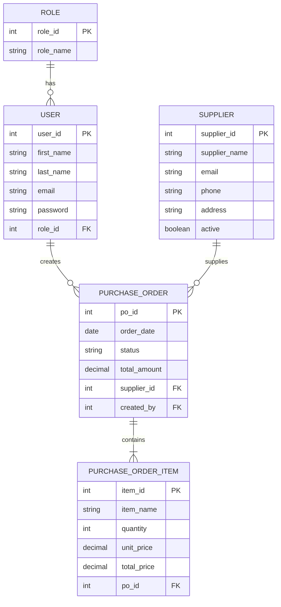

# Entity Relationship Diagram (ERD)

## Procurement Module

The Procurement module consists of the following entities:

- User
- Role
- Supplier
- Purchase Order
- Purchase Order Item

## ER Diagram

