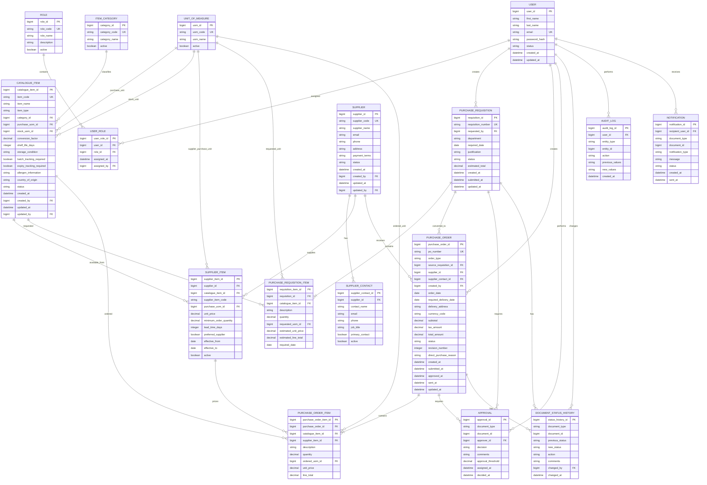

# Entity Relationship Diagram (ERD)

## NEXORA Procurement Module

## 1. Purpose

This document defines the logical Entity Relationship Diagram for the NEXORA Procurement Management module.

The model supports:

- user authentication and role-based access
- supplier management
- raw material and item catalogue management
- supplier-item purchasing information
- purchase requisitions
- standard purchase orders
- direct purchase orders
- approval workflow
- status history
- notifications
- audit history

Goods receipt, supplier invoices, inventory and accounting integration will be added in later phases.

---

## 2. Core Entities

### Security

- User
- Role
- User Role

### Supplier Management

- Supplier
- Supplier Contact

### Item Catalogue

- Item Category
- Unit of Measure
- Catalogue Item
- Supplier Item

### Purchase Requisitions

- Purchase Requisition
- Purchase Requisition Item

### Purchase Orders

- Purchase Order
- Purchase Order Item

### Workflow and Traceability

- Approval
- Document Status History
- Notification
- Audit Log

---

## 3. Entity Relationship Diagram

---

## 4. Key Design Decisions

### User and Role Relationship

A user may have more than one role.

The `USER_ROLE` entity supports a many-to-many relationship between users and roles.

---

### Standard and Direct Purchase Orders

Both Standard Purchase Orders and Direct Purchase Orders use the same `PURCHASE_ORDER` entity.

The `order_type` field identifies whether the order is:

- `STANDARD`
- `DIRECT`

For a Standard Purchase Order:

- `source_requisition_id` is required
- `direct_purchase_reason` is not required

For a Direct Purchase Order:

- `source_requisition_id` is null
- `direct_purchase_reason` is required

---

### Purchase Order Revisions

Approved Purchase Orders are not overwritten.

The `revision_number` field supports controlled amendments while audit and status-history records preserve the previous activity.

A more advanced revision table may be introduced later if full document version snapshots are required.

---

### Supplier-Item Catalogue

The `SUPPLIER_ITEM` entity maintains supplier-specific information such as:

- supplier item code
- unit price
- purchase unit
- minimum order quantity
- lead time
- preferred-supplier status
- price-effective dates

---

### Workflow Records

The `APPROVAL` entity records approval decisions.

The `DOCUMENT_STATUS_HISTORY` entity records every document status transition.

The `AUDIT_LOG` entity records broader changes to business records.

These entities have different responsibilities and should not be merged.

---

## 5. Phase 1 Exclusions

The following entities will be introduced in later phases:

- Warehouse
- Storage Location
- Inventory Balance
- Goods Receipt
- Goods Receipt Item
- Batch or Lot
- Quality Inspection
- Quarantine
- Supplier Invoice
- Supplier Invoice Item
- Three-Way Match
- Accounting Export
- Payment
- General Ledger Posting
